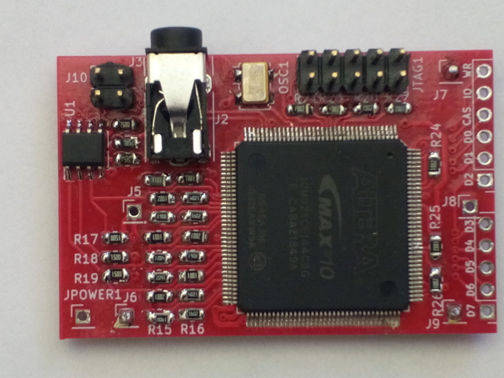
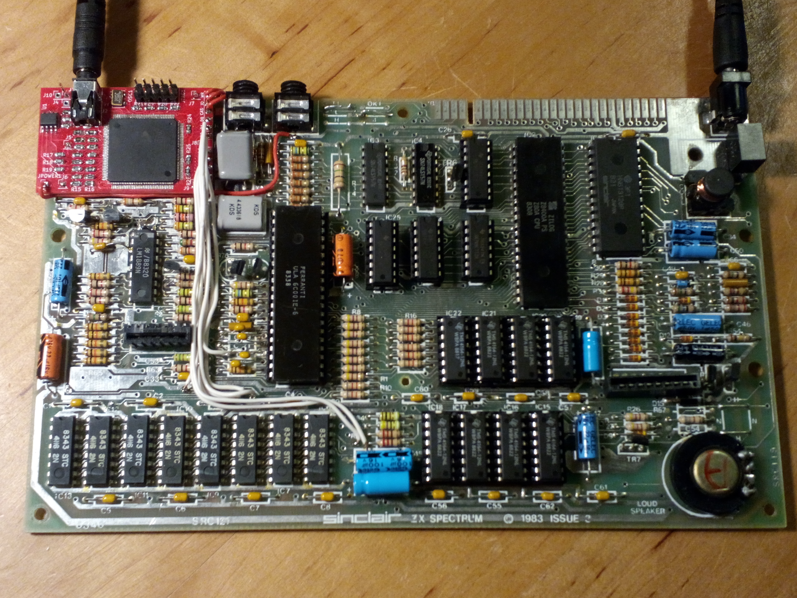
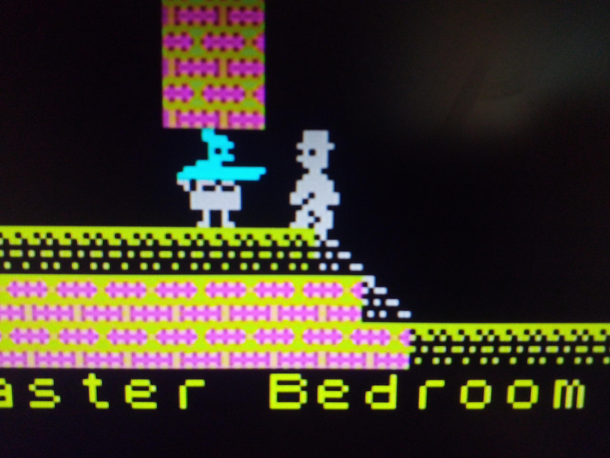

# ZX-Spectrum-Component-Video
Component video (YPbPr) output for the ZX Spectrum computer 

## General

The ZX Spectrum in its original form produces a radio frequency signal that can be fed into an analog TV. The quality of this
signal is very poor, but this can be improved by a simple modification that will make the ZX Spectrum output a composite video
signal instead. While this is actually better, it is nowhere near good. To bring the video quality to the next level,
this modification will produce a component video signal (YPbPr) that should be as good as an analog signal can possible get.
This video signal can be used either directly with a TV that has a YPbPr input, or it can be passed through a dedicated upscaler device
("Framemeister", "OSSC", etc.) before displaying on an HDMI screen.

This hardware modification is a more compact version of the solution that uses an A-Video board with seperate level shifters.
It tries to solve various shortcomings of https://github.com/c0pperdragon/A-VideoBoard/tree/master/zxspectrummod :

- Smaller and cheaper to make
- No need to modify the case of the ZX Spectrum
- No need to remove any components besides the RF modulator.

## Theory of operation

The mod board passively listens to various digital data lines through which the ULA communicates with the rest of the 
main board - specifically the signals CAS,RW,IOREQ and the data bus. This information is processed by the FPGA 
to figure out what image the ULA intends to display. The FPGA drives a simple 3-channel digital-to-analog converter built from
resistors to produce the 3 output voltages of the YPbPr signal.
Because the main board runs with 5 volt logic levels and the FPGA can only work with 3.3 volts, a voltage regulator and
two input level shifter ICs are necessary (on the bottom side of the mod board). 

## Video output possibilities

- 288p (default) or 576p
- YPbPr (default) or RGsB

Output modes can be selected by jumpers or optional switches.

The color palette I am using has slightly softened colors. The original monochromatic colors are just too hard on
my eyes especially when viewed on a modern display.
I took the platte from [https://lospec.com/palette-list/zx-spectrum] and in my opinion this really looks great.

## Drawbacks

Installation of the mod requires complete removal of the RF modulator. This also implies that an
existing composite video mod will no longer be available. Without further modification the 
ZX Spectrum will then work with component video output exclusively.

If you need composite video additionally you can wire up an extra connector, as the
original analog signals are still being produced by the video output circuit.

## Images

## Configuration jumpers

You can switch to 576p (enhanced definition TV - double vertical resolution) by bridging the jumper J10.
Likewise you can switch to RGsB output by briding the jumper J3.
Both can either be done with a jumper (permenant setting) or an optional external switch. You can
do that in whatever way you like - maybe there is even a solution that does not require to modify the
case.

## Video adapter cable

The mod uses a small TRRS jack to provide the component video signal. For use with standard cabling,
you will need an adapter to break out the 3 lines to individual RCA jacks. Take care to use a cable
that has the common ground on the sleeve of the tip-ring-ring-sleeve plug.
One possible ready-made product would be: [https://www.delock.de/produkte/S_62499/merkmale.html]

## Installation details

Remove an existing RF modulator completely and remove all the solder from the mounting holes.
Put the mod boad in place of the modulator and solder the two mounting pins. These pins will also
connect the GND levels.
For the following cabling I recommend some single stranded wire that is just thin enough to fit
into the various via holes of the main board. Using via holes wherever possible is the least invasive
option and is also easily reversible.

### Power

+5V power supply must be wired to the JPOWER1 hole of the board. A usable voltage source can be found
for example near the headphone jacks. Do not use the power line that was originally driving the 
RF modulator, as this is comming through some resistor and will not deliver enough current.

### Control signals

The three control signals CAS, IOREQ, WR can best be taken from the backside of the main board directly from
the ULA socket pins (see pin_assignment.txt for more details).

### Data signals

Signals D0 to D7 can be taken from various vias through which the data signals are 
sent on their way between the ULA and the RAM chips. 
The exact locations may differ with board revision. You may have to probe around with a multimeter
to find a conveniently located via for each signal. In the case that you can not 
find any accessible via, you can also solder your wire directly to the RAM chip (but only as last ressort).  

## Assembled boards

I do not expect too much demand for this device, so I will probably be able to provide a 
hand-assembled board for anyone who wants one. Prize may be somewhere in the 50€ range (plus shipping
and optional adapter cable). In this case drop me an email at reinhard.grafl (at) aon.at or
add a question to the issues section.
